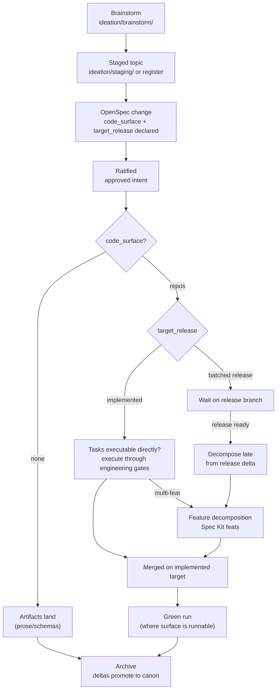

# Release Realization Flow

Status: ratified
Kind: process
Repository context: openxFactory
Ratified by: [add-release-realization-flow](../openspec/changes/archive/2026-07-09-add-release-realization-flow/proposal.md)
Purpose: define how OpenSpec changes with code surfaces are realized —
the realization axis, the archive gate, decomposition scale rules, release
targets, and the branch vocabulary — so brownfield tracking falls out of
archive discipline.

The load-bearing invariant: **promoted specs describe what the code does;
active changes describe approved intent not yet realized.** The diff
between canon and the active-change set is therefore the spec-vs-code
delta, maintained by nothing more than honoring the archive gate below.

## The Realization Axis

Every proposal declares two front-matter fields:

```text
code_surface: none | <repo>[, <repo>...]   runtime artifacts changed
target_release: implemented | <release-id>  where realization must land
```

`code_surface: none` (the default) is a doc-only change: it archives when
its artifacts land, exactly as before. A non-empty code surface engages
the realization gate.

## Lifecycle



## The Archive Gate

A code-surface change SHALL NOT archive until its code is merged on the
implemented target through the owning domain's engineering gates, plus a
green run where the surface is runnable. Until then it stays active —
approved, unrealized, and visibly so. Archiving an unrealized code-surface
change is a **contested-class act** under the doc-health contract: it
requires an explicit disposition, and doing it silently surfaces in the
regression diff.

If a change owns `supporting-docs/`, the archive gate also requires every
accepted normative claim to be represented in proposal, design, or spec delta;
one final NotebookLM source return when a hybrid exists; strict validation;
and deterministic packaging. The wrapper creates `supporting-docs.tar.gz` and
`supporting-docs.manifest.yaml` before invoking normal `openspec archive`, so
spec promotion is unchanged.

## Decomposition Scale Rule

- Tasks individually executable → the change's task list IS the feat plan;
  execute through branch-review → pr-admission → merge-readiness.
- Multi-feature scope → codexFactory `feature-decomposition` emits the feat
  DAG; `spec-kit-execution` runs each feat. A ratified code-surface change
  is an admitted engineering intent record for `approved-intent-intake`.
- Batched release → decompose LATE, from the delta between the release
  branch and the implemented target at release-merge time, so feats stay
  fresh against the moved target.

## Release Targets And Branch Vocabulary

- The **implemented target** defaults to each affected repository's main
  line. Named releases are defined in the aggregation repository (the only
  repo that sees every pin), are **branches while open, tags at promotion**.
- Three branch kinds, never conflated: the OpenSpec **change folder**
  (content branch), Spec Kit **feature branches**, and **release branches**
  (integration).
- Ordered deltas: a proposal modifying a requirement that an active
  ratified change already modifies must reference it and declare its deltas
  relative to that change's outcome (first-ratified wins ordering).

## Case Study: The Pilot

`implement-doc-health-checker` (codexFactory, archived 2026-07-09) chose
realization archival at its proposal gate — before this capability existed
— and proved the model: it stayed active through three failed nightly
runs (approved intent, honestly unrealized), archived only after the green
run, and located its "release" in the aggregation repo's main line. Its
scale fit the direct-task path: no feature DAG was needed. The rules above
codify that experience; the parts the pilot did not exercise (multi-feat
DAGs, batched release branches, delta stacking) carry declared shape but
no operational history yet.

## Future Enforcement

The realization gate is checkable: a doc-health family can flag active
code-surface changes older than a threshold without realization evidence,
and archived code-surface changes without a recorded green run. Candidate
for the checker's next contract delta.
