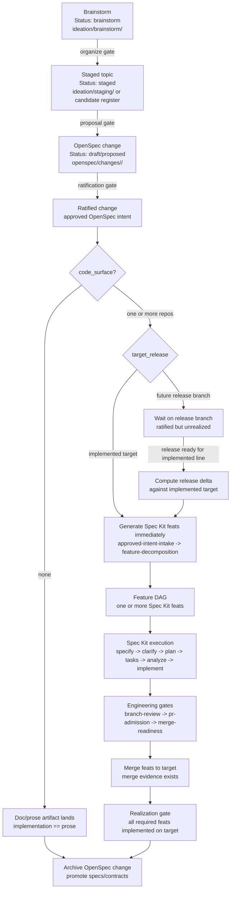

# OpenSpec × Speckit Release Flow (Brownfield) — Brainstorm

Status: staged
Captured: 2026-07-09; organized 2026-07-09 into
[staging/release-flow/organized-model.md](../staging/release-flow/organized-model.md)
and proposed as
[add-release-realization-flow](../../openspec/changes/add-release-realization-flow/proposal.md)
after the implement-doc-health-checker pilot answered the open questions.
Kept as design history. Nothing in this document is policy.
Repository context: openxFactory (contract-level, cross-factory topic)
Participants: Brett Heap, Claude (design session)

## Problem

Today OpenSpec changes carry doc-only implementations: tasks edit prose and
the change archives when the prose lands. Once code exists, "implemented"
splits into two truths — what the ratified spec says and what running code
does — and archiving on doc-landing would silently break the link. Brownfield
tracking requires the lifecycle to know which approved intent is realized in
code, in which release, and which is still waiting.

## Captured model (Brett, 2026-07-09)

1. An OpenSpec proposal lands into its change branch.
2. The change targets a release: either the **implemented target** (the line
   running code tracks) or a **not-yet-implemented larger release branch**.
3. Merge to the implemented target ⇒ immediately generate code feats
   (Spec Kit features) realizing the change against that target.
4. Merge to a non-implemented release branch ⇒ wait; when that release
   branch is ready to merge into the implemented line, use the **delta** to
   generate the feats to implement.
5. Only after the code feats complete through Spec Kit does each OpenSpec
   change archive.
6. Result: the archive gate tracks brownfield reality, not paperwork.

## The load-bearing invariant

**Promoted specs (`openspec/specs/`) describe what the code does; active
changes describe approved intent not yet realized.** Under this invariant,
the diff between canon and the active-change set IS the spec-vs-code delta —
brownfield tracking falls out of archive discipline for free. (Doc-only
changes keep today's behavior: their "code" is the prose, so they archive on
doc-landing. The realization axis only bites when a change declares a code
surface.)

## Mapping onto existing assets (build, don't invent)

- "Generate code feats from the change/delta" is exactly codexFactory's
  `feature-decomposition` workflow: the ratified OpenSpec change is the
  *approved engineering intent record* that `approved-intent-intake`
  admits; decomposition emits the feature DAG; `spec-kit-execution` runs
  each feat; `branch-review` → `pr-admission` → `merge-readiness` gate the
  landing.
- The archive gate binds to merge evidence: an OpenSpec change with a code
  surface MUST NOT archive until its decomposed feats' merge-readiness
  packets exist on the implemented target. (Health checker rule.)
- Two-axis state for a change:
  spec axis `proposed → ratified → archived` ×
  realization axis `unrealized → targeted(<release>) → decomposed →
  implemented-on-target`. Proposal front-matter grows `target_release:` and
  `code_surface: none | <repos>`.
- Release branches are git; the OpenSpec change folder remains the content
  branch. Three different "branches" now exist — change folder (content),
  feat branches (Spec Kit), release branches (integration) — the doc that
  ratifies this flow must define all three or the terminology will rot.

## Visualization

This view maps the current document lifecycle gates onto the brownfield
OpenSpec-to-Spec-Kit realization path.



Read the key boundary as:

```text
ratified does not mean archived when code_surface is non-empty.
archive waits for realization evidence on the implemented target.
```

## Open questions

- Late vs early decomposition for batched releases: the captured model
  decomposes at release-merge time (from the delta); alternative is
  decompose-at-ratification and let feats wait on the release branch. Late
  keeps feats fresh against the moved target; early surfaces sizing sooner.
  Possibly: decompose early for the implemented target, late for batched
  releases.
- Where release definitions live: aggregation repo (it owns pins/assembly)
  vs openxFactory (it owns workflow policy)?
- Does a waiting change block conflicting later changes (first-writer-wins
  on a requirement) or do they stack as ordered deltas?
- Interaction with domain repos: a change whose code surface spans multiple
  DomainxFactories decomposes per-repo — who owns the cross-repo feat DAG?
- Tag vs branch for release targets ("target release tag branch"): pick one
  primitive and define the promotion moment precisely.

## Exit

Organize into a staged topic (likely `staging/release-flow/`) once the open
questions have recommendations; exits as an openxFactory contract change
(release/realization axis on OpenSpec changes + archive-gate rule) paired
with a codexFactory delta wiring decomposition intake to ratified changes.
