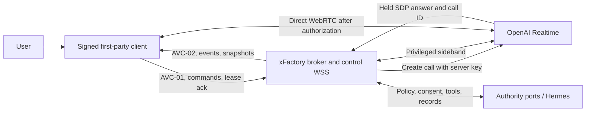

# Avatar Client Trust-Boundary Threat Model

Status: ratified
Kind: report
Captured: 2026-07-10
Accepted: 2026-07-12
Ratified by: define-avatar-client-contract-kernel (task 1.1); acceptance conditions closed at the contract-v1.7 realization gate
Proposed by: define-avatar-client-runtime
Target capability: avatar-client-runtime

This record defines the bounded threat model required before the AVC contract
kernel freezes. The current design and delta specifications are authoritative
if this report differs from them.

## Scope And Assets

Protected assets are user audio, disclosure and consent state, provider and
control credentials, SDP, actor/client/subject context, workflow authority,
confirmation decisions, external-operation idempotency, structured records,
and redacted telemetry.

Continuous media does not traverse xFactory. The server owns provider call
creation, profile configuration, sideband, tools, outcomes, revocation, and
hangup. The client owns local device access and direct WebRTC transport.
Initial broker authentication uses an OIDC bearer validated against the target
tenant/client context. An AVC-02 grant then issues a short-lived control
credential bound to logical session, epoch, media leg, and client instance for
the authenticated xFactory WSS; neither credential may appear in a URL.

## Trust Classification

| Surface | Trust granted | Trust explicitly denied |
| --- | --- | --- |
| Signed first-party media adapter | Local disclosure, capture gating, answer application, playback gating, provider-event allowlist | Policy, consent evidence, confirmation, tools, workflow outcomes |
| Client widgets and commands | Presentation and untrusted intent | Identity, authority, external execution, provider configuration |
| Broker/control runtime | Identity derivation, leases, sequencing, results, revocation | Domain policy invention |
| Authority ports / Hermes | Consent, policy, confirmation, tool execution, records | Client presentation state |
| Provider and provider events | Approved media processing and observations | xFactory workflow authority |
| Telemetry and caches | Minimum operational metadata under declared retention | Raw media, transcript, SDP, credentials, arbitrary subject identifiers |

The signed client media adapter is in the confidentiality trusted computing
base because a direct client-provider media path cannot cryptographically stop
a compromised client from transmitting audio. Sideband can detect and contain
that behavior but cannot retroactively prevent disclosure. Desktop signing or
web deployment-integrity evidence is therefore required before internal live.
Commands and provider events remain untrusted even when the client is genuine.

## Threats And Required Controls

| ID | Threat | Required control | Verification |
| --- | --- | --- | --- |
| TM-01 | Forged body identity or purpose | Derive actor/client/subject scope from OIDC-authenticated transport; body values are references only | Forged-context fixtures |
| TM-02 | Answer applied before server control exists | Broker holds answer until sideband verification; trusted adapter waits for matching `media_authorized` before applying it | F0 ordering trials and client reducer test |
| TM-03 | Compromised client bypasses local media gate | Classify security incident, reject all authority effects, hang up immediately, require client-integrity evidence | Modified-client deterministic test; incident telemetry review |
| TM-04 | Sideband never attaches | Three-second default/five-second maximum readiness timer; no answer release before sideband; provider hangup; AVC-02 `media_readiness_timeout` | F0 failure-injection trials |
| TM-05 | Provider or control credential leaks | Standard key server-only; scoped credentials excluded from URLs/logs; pending grant only in TTL ephemeral cache | Secret/redaction fixtures and scans |
| TM-06 | SDP replay or request substitution | Exact-byte server SHA-256 offer fingerprint; same-request equality; changed offer returns `idempotency_conflict` | Retry and mismatch fixtures |
| TM-07 | Duplicate external action after reconnect | Command-ID dedupe owned by authority boundary; recorded outcome returned; client/provider observations never prove completion | Duplicate-command tests |
| TM-08 | Stale epoch, lease, or client instance acts | Epoch fencing, one client/leg, heartbeat and lease ceilings, transport-derived context | Lease, second-instance, stale-epoch tests |
| TM-09 | Consent changes while media continues | Client stops locally before withdrawal command; server pushes revocation and invokes provider hangup within five seconds | Revocation tests and F0 hangup trials |
| TM-10 | Provider tool intent bypasses policy | Tools and responses exist only on privileged sideband; authority port validates purpose, consent, state, and confirmation | Unauthorized-producer and tool tests |
| TM-11 | Snapshot race causes stale action | Atomic barrier `B`, snapshot through `B`, bounded `B+1...` buffer, restart on overflow | Snapshot-race fixtures |
| TM-12 | Telemetry or support artifacts expose protected content | Allowlisted structured fields; publication fails on SDP, credentials, transcript, media, or prohibited identifiers | Redaction validator fixtures |
| TM-13 | Memory consent is mistaken for media authorization | Neutral avatar purpose registry plus server-side consent-authority adapter; no inference from memory schema alone | Consent-adapter fixtures |
| TM-14 | Raw provider error manipulates UI | AVC-02 safe reason registry, message keys, retry and fallback values; raw errors remain adapter-local | Outcome schema and widget tests |

## Residual Risks And Boundaries

- A compromised endpoint can record or exfiltrate microphone data outside this
  protocol. Client integrity, OS permissions, incident response, and endpoint
  management mitigate but do not eliminate that risk.
- OpenAI receives authorized direct media after `media_authorized`; contractual,
  privacy, and regional processing controls are provider-qualification work.
- F0 validates protocol feasibility with generated test audio; it is not a
  privacy review, penetration test, provider qualification, or production
  authorization.
- The reference authority implementation uses fixtures. Real Hermes and domain
  consent integrations remain blocked until `avatar-pilot-hardening`.

## Acceptance

This threat model is acceptable for contract freeze only when:

1. TM-01 through TM-14 each map to a task and evidence ID;
2. the F0 mandatory ordering, timeout, redaction, and hangup assertions pass;
3. the design and runtime delta use the same trust classification;
4. no artifact claims sideband termination prevents prior disclosure; and
5. a reviewer records approval or requested changes in the F0 result record.

## Acceptance record — 2026-07-12 (contract-v1.7 realization gate)

Accepted by the AVC contract-kernel owner as the T044(d) precondition to the
`contract-v1.7` tag. Each condition is met:

1. **Met** — TM-01…TM-14 map to tasks and evidence IDs in
   `contracts/avatar-client/evidence-register.yaml` / `acceptance-map.yaml`
   (structural, held since contract freeze).
2. **Met** — F0 mandatory assertions PASS: ordering (`F0-A-ORDERING`),
   timeout (`F0-C-READINESS_TIMEOUT`), redaction (`redaction_scan: PASS`), and
   hangup/revocation (`F0-D-TERMINAL_5S`, `F0-D-NO_LATE_IO`) — 70/70 live
   trials, `qualify-avatar-brokered-call-feasibility` harness commit `5142065`.
3. **Met** — design and runtime deltas share the trust classification
   (unchanged since freeze).
4. **Met** — no artifact claims sideband termination prevents prior
   disclosure. The ACR-005 ruling (`change/clarify-avatar-revocation-client-enforced`)
   makes revocation **client-enforced**: the ≤5 s guarantee is the client-side
   media stop plus the accepted provider hangup request; provider-side settle
   (~8.1 s) is recorded informationally.
5. **Met** — reviewer disposition recorded in the F0 evidence packet
   (`evidence/f0-terminal-pass-report-2026-07-12.md`,
   `evidence/f0d-revocation-rerun-notes-2026-07-12.md`), alongside the
   machine-verified assertion results in `evidence/f0-results.json`.
