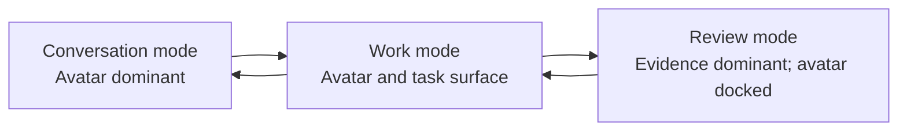
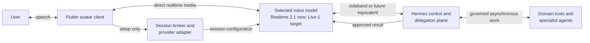
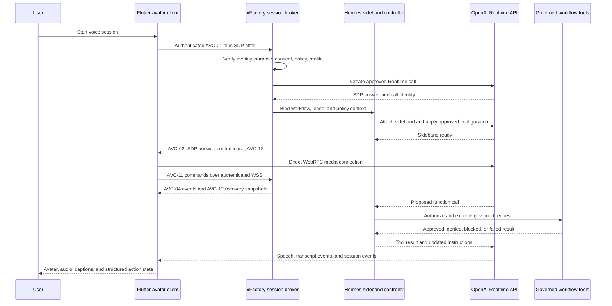

# Flutter Avatar Client And UI Lab

Status: draft
Kind: architecture exploration
Captured: 2026-07-10
Updated: 2026-07-10 with GPT-Live-1 target and approved clarifications
Repository context: openxFactory (contract-level, cross-factory topic)
Proposed by: define-avatar-client-runtime
Staging ID: openxFactory:staging:avatar-client
Target capabilities: avatar-first-ui, avatar-client-runtime
Related standards:
[Avatar-First UI Standard](../../../../docs/avatar-first-ui-standard.md),
[Workflow Visualization Standard](../../../../docs/workflow-visualization-standard.md)
Companion drafts:
[Neutral Runtime Contracts](avatar-client-neutral-contracts.md),
[F1-F4 Acceptance Scenarios](avatar-client-f1-f4-acceptance.md)

This proposal supporting document is non-normative. It records the approved
implementation direction that the proposal deltas make normative where
required.

## Approved Direction

Use Flutter for the reusable **avatar interaction client**, but do not require
Flutter to implement every xFactory administrative and workflow-review
surface.

The client should be split by interaction need:

```text
openxFactory contracts
  -> Flutter avatar client
       conversation, voice, captions, guided work, consent, approval, handoff
  -> web operations console
       queues, dense configuration, interactive diagrams, evidence, and audit

both clients
  -> the same Hermes session, workflow, policy, and tool APIs
```

Flutter is a strong test vehicle for the avatar because the experience is
app-like, media-heavy, animated, and expected to span mobile, desktop, kiosk,
and web contexts. A web console remains the stronger fit for dense operational
work and preserves the current React Flow and XState visualization standard.

The avatar is the primary guide, but it is not required to consume the largest
screen region in every state.

## Approved Clarifications

Approved by Brett Heap on 2026-07-10. These are accepted design inputs for the
future staged proposal; they are not ratified openxFactory policy until they
pass the ideation and OpenSpec lifecycle.

1. The Flutter implementation will live in a new private
   `xfactory-avatar-client` repository. openxFactory will retain ownership of
   neutral contracts, profiles, conformance fixtures, and acceptance rules.
2. The first UI-lab targets are Windows desktop and web. iOS and Android
   validation follows after the first slices work on those targets.
3. The first adapter supports interchangeable OpenAI voice models. The neutral
   contract remains capable of adding another provider later, but the first
   implementation will not build unused provider integrations.
4. Direct Flutter-to-OpenAI WebRTC is a hard requirement whenever the approved
   API supports it. xFactory must not relay ordinary media merely to preserve a
   generic abstraction.
5. A human release owner must approve promoting GPT-Live-1 after contract
   tests, evaluations, and an opt-in canary. API availability alone does not
   activate the model.
6. Model-profile changes apply to new sessions. An active session may change
   models only through a visible reconnect and recovery path.
7. Ordinary conversation streams under Hermes monitoring. Consequential tools
   require structured confirmation and approval. Pre-speech review is limited
   to response classes whose domain policy explicitly requires it.
8. Hermes remains authoritative for delegation, tools, and external work even
   if GPT-Live-1 exposes native deeper-work delegation. The live model may
   maintain conversational flow while Hermes-governed work runs.
9. Live captions are ephemeral by default. Structured confirmations, consent,
   approvals, and resulting workflow records are retained. Full transcript and
   audio retention are explicit domain and client policy choices.
10. The first transport spike establishes direct-provider latency baselines.
    Numeric median and tail SLOs are set from those measurements, then enforced
    as both absolute targets and maximum adapter regressions.
11. The first reference workflow is generic service intake: request, missing
    information, interpreted summary, user correction, confirmation, and a
    governed action or handoff.
12. The first avatar is a lightly animated, non-photorealistic portrait with
    listening, thinking, speaking, interrupted, blocked, and handoff states.
    Full lip synchronization is not part of the first release.
13. Each domain supplies a small approved persona and voice catalog. The user
    may choose among allowed options, and the selected persona remains stable
    throughout the session.
14. Deterministic UI scenarios and draft workflows function offline. Live
    voice requires connectivity and must present that dependency clearly.

## Adaptive Interaction Modes

The same Flutter shell should support three modes rather than forcing one
layout onto every workflow.

| Mode | Visual priority | Best fit |
| --- | --- | --- |
| Conversation | Avatar and active turn dominate | Onboarding, explanation, intake, training, language selection |
| Work | Avatar shares space with a task surface | Forms, record confirmation, approvals, guided fulfillment |
| Review | Evidence or workflow view dominates; avatar docks | Consent walkthroughs, comparisons, exceptions, audit explanation |



## Why Not Flutter-Only

The promoted workflow-visualization capability currently names React Flow as
the first-choice editable canvas and XState as the workflow state model. The
nine-view client validation walkthrough also includes evidence graphs,
current-to-target differences, swimlanes, gates, exception paths, bottlenecks,
and consent records.

A Flutter-only implementation would require one of these decisions:

1. Reimplement the interactive visualization capability in Flutter.
2. Embed the React canvas in a web view and maintain a cross-runtime state and
   accessibility bridge.
3. Amend the promoted visualization requirement after evaluating a suitable
   Flutter-native MIT-licensed stack.
4. Keep interactive workflow review in a separate web console while Flutter
   renders read-only summaries and launches the full review surface when
   needed.

The approved direction is option 4. Embedding a web view is not the
default because it would add lifecycle, authentication, accessibility,
navigation, and testing complexity at the boundary between Flutter and the web
runtime.

## UI Lab Before Live AI

The first Flutter application should be a deterministic UI lab. It should not
depend on a live model to produce the states needed for design and testing.

The lab should provide selectable scenario fixtures for:

- ordinary product or service intake
- missing or contradictory information
- disclosure and communication preferences
- user confirmation and correction
- consent requested, granted, declined, or withdrawn
- governed tool request awaiting approval
- approved, denied, or failed tool execution
- blocked workflow with a plain-language explanation
- user-requested and policy-required human handoff
- unsupported language or accessibility fallback
- network interruption, reconnect, and session recovery
- avatar minimized into work or review mode
- completed, abandoned, escalated, and archived sessions

The lab should expose developer-only controls for selecting a scenario,
advancing or rewinding the state, injecting latency and failures, changing the
viewport, switching language, enabling reduced motion, and inspecting emitted
events. Those controls are test instrumentation, not part of the production
user experience.

The deterministic scenario engine and local draft state must work offline.
Connecting to a live voice model is a separate online capability and must not
be required to inspect, replay, or test the interface states.

This approach separates two questions that otherwise become tangled:

```text
Does the interaction work for the user?
  tested deterministically in the UI lab

Can the AI and governed runtime drive it correctly?
  tested later through the shared session protocol
```

## OpenAI Realtime Voice Baseline

Official OpenAI documentation checked on 2026-07-10 lists
`gpt-realtime-2.1` as the newest full Realtime reasoning voice model. It
updates `gpt-realtime-2` with improved alphanumeric recognition, silence and
noise handling, and interruption behavior. `gpt-realtime-2` remains a valid
model, but it should not be named as the new default in this design.

The current Realtime prompting guide still names `gpt-realtime-2`, while the
model catalog, `gpt-realtime-2.1` model page, and current WebRTC examples use
`gpt-realtime-2.1`. Treat the catalog and model page as the naming authority,
and carry prompting guidance forward only after evaluating it against 2.1.

The current and target decision is:

```text
now
  primary_live_voice -> OpenAI Realtime adapter -> gpt-realtime-2.1

after API release and qualification
  primary_live_voice -> OpenAI Live adapter -> gpt-live-1
```

This uses the Realtime 2 family now, specifically the newest API model in that
family, while making GPT-Live-1 the intended successor. OpenAI announced
GPT-Live-1 for ChatGPT on 2026-07-08 and stated that API availability is
planned soon. The public API model catalog does not list GPT-Live-1 yet, so its
future transport, session, event, tool, transcript, pricing, data-control, and
snapshot contracts must not be invented in advance.

The proposed model profile is:

| Role | Proposed default | Purpose |
| --- | --- | --- |
| Current primary conversation | `gpt-realtime-2.1` | API-available speech-to-speech conversation, reasoning, instruction following, and tool selection |
| Future primary conversation | `gpt-live-1` after qualification | Full-duplex continuous interaction and delegation when its API contract becomes available |
| Cost and latency evaluation | `gpt-realtime-2.1-mini` | Faster, lower-cost alternative for simple or high-volume workflows |
| Optional independent live transcription | `gpt-realtime-whisper` | Streaming transcript deltas when a separate transcription channel is justified |
| Optional interpreter mode | `gpt-realtime-translate` | Dedicated live speech-to-speech translation rather than ordinary multilingual conversation |

These are deployment-profile defaults, not Flutter constants. The UI should
receive an opaque voice runtime profile from the session broker and should not
choose the production model, reasoning effort, prompt, tools, or safety policy.
The profile should carry a capability name such as `primary_live_voice`,
with the server resolving that name to a currently approved model.

Model aliases may change over time. Before each production release, the
deployment owner should reverify model availability, behavior, data controls,
rate limits, and whether an immutable snapshot is available. A model upgrade
should run the same scenario and voice evaluations before becoming the default.

## Portable Voice Runtime Without Media-Path Overhead

Model portability must not be implemented by putting a generic xFactory audio
proxy between Flutter and the selected voice provider. That would make every
audio packet pay for another network hop, buffering boundary, failure point,
and possible transcode.

Instead, split the architecture into layers with different timing needs:

```text
Flutter experience layer
  avatar, captions, controls, workflow cards, accessibility

neutral voice-session contract
  session request, capability profile, canonical lifecycle and audit events

provider session adapter
  session setup, credential exchange, SDP negotiation, provider event mapping

direct media data plane
  Flutter <-> selected provider over the provider's approved realtime transport

Hermes control and delegation plane
  policy, tool authorization, deeper reasoning, workflow state, audit, handoff

domain execution plane
  approved xFactory tools, records, integrations, and accountable humans
```

The provider adapter is selected once during session setup. It resolves the
stable profile name `primary_live_voice` and returns a client transport
configuration. It does not inspect, copy, transform, or route each audio frame.
Provider event translation happens locally in the client or asynchronously on
the control connection and must not block audio playback.



### Latency Requirement

Literal zero latency is not physically achievable. The design requirement is
**no avoidable xFactory-added latency in the continuous media path**.

The first implementation should enforce these constraints:

- no xFactory network relay for ordinary microphone and model audio
- no audio transcoding unless a selected provider requires it
- no per-frame provider abstraction or remote policy lookup
- no synchronous transcript persistence before playback
- no tool or workflow round trip for harmless conversational acknowledgements
- cached session policy and provider profile before the first user turn
- asynchronous event normalization, audit emission, and transcript storage
- explicit pending UI and a short spoken preamble when governed work takes time
- text fallback without creating a second workflow session

The latency test harness should timestamp microphone capture, detected speech
start and stop, provider response creation, first received audio, playback
start, interruption detection, animation stop, and tool-result return. Compare
each adapter against a direct-provider reference implementation. Promotion
must fail when the abstraction adds a material regression at median or tail
latency; numeric budgets should be set from the first measured baseline rather
than guessed in this brainstorm.

### Continuous Interaction And Deeper Work

OpenAI describes GPT-Live as separating continuous interaction from deeper
search, reasoning, and agentic work. xFactory should preserve the same
separation independently of a specific model:

```text
interaction lane
  listens, speaks, acknowledges, clarifies, displays state, and preserves flow

work lane
  reasons deeply, searches, calls tools, requests approval, and executes work

Hermes lane
  decides what can run, what needs consent, and what must stop or escalate
```

The interaction lane may answer low-risk conversational turns directly under
preloaded policy. It may start asynchronous read-only or preapproved work and
keep the user informed while waiting. Writes, privileged actions, regulated
decisions, and consequential recommendations remain governed even when that
adds deliberate task latency. Low conversational latency must never be used to
justify bypassing an authority gate.

Domains should be able to select a speech gate mode:

| Mode | Behavior | Use |
| --- | --- | --- |
| `streaming_monitor` | Speech streams directly while Hermes monitors and may steer, pause, or escalate | Ordinary guided conversation |
| `confirmation_before_action` | Conversation remains live, but consequential tools wait for structured user confirmation and Hermes approval | Default client workflow actions |
| `pre_speech_review` | Selected response classes wait for review before playback | Narrow high-risk or regulated statements where policy requires it |

The third mode intentionally adds latency. It should be exceptional and scoped
to the response class, not applied to every turn.

## Voice Runtime Capability Contract

The neutral contract should describe required capabilities rather than assume
that GPT-Live-1 will copy the current Realtime API. Each provider adapter must
report at least:

- connection transports and direct-client support
- full-duplex listen-and-speak behavior
- interruption and output truncation behavior
- input and output transcript events
- function or tool calling
- server sideband or equivalent control channel
- asynchronous delegation or concurrent work support
- available voices and voice continuity rules
- image input and visual-result events
- session duration and reconnect behavior
- brokered SDP and ephemeral client credential support, with production
  authorization posture declared separately
- regional availability and approved data controls
- stable model aliases or snapshots

The UI enables features from this negotiated capability object. It must not
infer capability from a model name or contain branches such as
`if model == gpt-live-1` throughout the widget tree.

## GPT-Live-1 Activation Gate

GPT-Live-1 should replace the current primary profile only after all of these
conditions are met:

1. OpenAI publishes an API model ID and supported API contract.
2. Required account, regional, retention, and data-control terms are approved.
3. The adapter proves direct low-latency Flutter transport without a media
   proxy.
4. Required transcript, interruption, tool, sideband or equivalent control,
   and reconnect capabilities pass contract tests.
5. The deterministic UI scenarios and domain voice evaluations pass.
6. Latency and conversational-flow results meet or improve on the
   `gpt-realtime-2.1` baseline.
7. Safety, exact-value capture, consent, handoff, and blocked-state evaluations
   pass for generic, MedxFactory, and LedgerxFactory scenarios.
8. An opt-in canary on new sessions succeeds with rollback available through a
   server-side profile change.

Do not shadow live customer audio to both models without explicit consent and
an approved data purpose. Use synthetic and consented evaluation recordings
first. Switch model profiles only when starting a new session; do not silently
change the voice model inside an active conversation. A mid-session migration
requires an explicit reconnect state and must preserve the canonical workflow
and audit record.

## Voice Session Topology

Use WebRTC for the Flutter client connection. OpenAI recommends WebRTC rather
than WebSockets for browser or mobile clients because it provides more
consistent realtime performance. A candidate Flutter transport is the
MIT-licensed `flutter_webrtc` package, which currently declares Android, iOS,
Linux, macOS, Windows, and web support. Its transitive dependencies and target
platform behavior still require an adoption-time review and spike.

The client must never contain a standard OpenAI API key. The production OpenAI
profile uses brokered SDP: Flutter sends its offer to the authenticated
openxFactory session broker, the broker creates the Realtime call with the
server key, captures the call ID, and attaches the Hermes sideband controller.
The broker returns the SDP answer only after sideband readiness and approved
session configuration are confirmed. Continuous media is direct after that
setup. Ephemeral client secrets remain a non-consequential lab option, not an
equivalent production authorization mode.

The sideband controller monitors the session, owns instructions and tool
definitions, receives tool calls, and returns governed results without placing
business logic or privileged credentials in Flutter. The Flutter data-channel
adapter is allowlisted and exposes no generic provider JSON send operation.



The Flutter client may render tool intent and approval state, but it must not
execute a model function call directly. Every call is an untrusted proposal
until Hermes validates the session, user, consent, workflow state, tool class,
arguments, credentials, and required approval.

## Turn-Taking And Interruption

The first evaluation should compare these interaction profiles:

| Profile | Turn detection | Use |
| --- | --- | --- |
| Guided conversation | Semantic VAD with low or automatic eagerness | Lets customers pause and think without the avatar interrupting too quickly |
| Operator conversation | Semantic VAD with automatic or medium eagerness | Balances responsiveness with natural staff conversation |
| Noisy or controlled environment | Tuned server VAD | Uses explicit audio threshold, prefix padding, and silence duration |
| Accessibility fallback | Push to talk | Gives the user deterministic control when automatic turn detection fails |

WebRTC interruption should remain enabled in ordinary conversation. OpenAI's
Realtime server automatically truncates unplayed output audio on WebRTC when
the user interrupts. The Flutter avatar must react to the same lifecycle by
stopping its speaking animation immediately, returning to listening, and not
displaying unplayed text as though the user heard it.

The UI lab should simulate false starts, long pauses, background speech,
side conversations, accidental interruption, and a user correcting the avatar
mid-sentence. Turn detection is a user-experience policy, not merely an audio
setting.

## Captions, Transcript, And Exact Values

The speech-to-speech session and its configured transcript events should first
be used to provide the live user and avatar captions needed for the ordinary
UI. A separate `gpt-realtime-whisper` transcription session should be added
only when this path cannot meet the independent transcript latency, audit, or
evaluation need well enough to justify sending and reconciling a second audio
stream.

Realtime transcript text is not an authoritative business record. Names,
account numbers, dates, medication names, addresses, confirmation codes, and
other consequential values must be shown in a structured confirmation surface.
The user should be able to correct the value with voice, keyboard, or touch,
then explicitly confirm it before a governed write or high-impact action.

The canonical transcript should retain stable item identifiers and distinguish:

- provisional user caption
- final user transcript segment
- generated avatar caption
- audio that was generated but interrupted before playback
- user correction
- structured value confirmed by the user
- independent transcription result, when enabled

Independent transcripts may disagree. Reconciliation should preserve both
source results and the user-confirmed structured value rather than silently
overwriting one transcript with another.

Default retention is intentionally asymmetric:

```text
ephemeral by default
  live captions, partial transcript deltas, uncommitted audio buffers

retained as workflow records
  confirmed structured values, consent, approval, denial, handoff, action result

retained only by explicit domain and client policy
  full transcript, source audio, independent transcription output
```

## Prompt And Reasoning Policy

Start `gpt-realtime-2.1` at low reasoning effort for ordinary guided work, then
evaluate latency and task success. Higher reasoning effort may be selected by a
server-owned workflow profile for complex routing or diagnostics, but it does
not replace approval, consent, deterministic validation, or human review.

The server-owned prompt should use short labeled sections for role, objective,
tone, language, reasoning, tools, unclear audio, exact-value capture,
preambles, escalation, and forbidden authority claims. Tool behavior should be
declared per tool class:

```text
READ
  may proceed without confirmation when policy and consent allow

PREAMBLE
  briefly explain a noticeable lookup or handoff before requesting it

CONFIRMATION_FIRST
  require explicit confirmation before proposing a write or consequential act

PROHIBITED
  never expose to the Realtime session as an available tool
```

The model may produce a short spoken preamble while waiting for a governed
operation, but it should describe the action rather than private reasoning. A
slow tool must also create a visible pending state so the experience does not
depend on spoken filler.

## Voice Failure And Fallback

The voice channel must degrade without abandoning the workflow:

```text
voice healthy
  -> audio plus captions plus conventional controls

microphone or WebRTC failure
  -> text conversation with the same session and workflow identity

model or provider unavailable
  -> approved fallback profile or human handoff

caption uncertainty on consequential value
  -> structured confirmation before continuing

session control or policy channel lost
  -> pause governed actions; allow safe explanation and reconnection only
```

Flutter should distinguish recoverable media loss from loss of the Hermes
control channel. If sideband supervision or workflow authority is unavailable,
the avatar may explain the interruption but must not continue tool-driven work.

## Proposed Implementation Slices

Each slice should end in a demonstrable user workflow, automated tests, and a
small set of reusable components. Later slices should consume the earlier
contracts rather than bypassing them.

| Slice | Deliverable | Acceptance focus |
| --- | --- | --- |
| F1. Shell | Windows and web Flutter app, lightly animated non-photorealistic avatar, conversation rail, context panel, action bar, handoff, settings, and approved persona selection | Responsive desktop and browser layouts, keyboard use, text-only mode, reduced motion, stable component sizing, persona continuity |
| F2. Deterministic session | Scenario engine, canonical session states, text turns, disclosure, transcript, pause and resume | Every canonical state is reachable and visually testable without a live service |
| F3. Client workflow | Generic service intake from request through missing-information collection, interpreted summary, correction, confirmation, and governed action or handoff | Avatar guidance and conventional structured controls cooperate on a complete task online or as an offline draft |
| F4. Governed actions | Tool-request cards, approval state, consent records, denial explanation, blocked state, and handoff | The avatar cannot imply authority or bypass user, Hermes, or accountable-human gates |
| F5. Local media prototype | Microphone permissions, local loopback or recorded fixtures, captions, interruption, speaking/listening states, and simple animation | Audio UX and platform permissions work without depending on a live model |
| F6. Portable OpenAI voice binding | Capability-based adapter with `gpt-realtime-2.1`, brokered SDP, direct WebRTC media, authenticated WSS control, Hermes sideband readiness, governed tools, leases, snapshots, latency instrumentation, reconnect, and a disabled GPT-Live-1 target profile | Deterministic fixtures and live Realtime behavior use the same AVC-01 through AVC-12 contracts without adding a media proxy |
| F7. Domain overlays | Generic, MedxFactory, and LedgerxFactory personas, terminology, disclosures, tools, and themes | Domain specialization does not fork the shell or session protocol |
| F8. Review handoff | Read-only workflow summary in Flutter and authenticated transition to the web review console | Context and user identity survive the boundary without embedding authority in the avatar client |
| F9. Hardening | Audit coverage, privacy controls, telemetry, failure recovery, performance, golden tests, iOS and Android validation, and device testing | The reference client is suitable for reuse rather than remaining a visual demo |

F1 through F4 form the first useful release. They prove the complete
interaction and authority model using text and a visual avatar. Voice and richer
animation follow after consent, approval, handoff, and recovery are correct.

## Shared Contract Boundary

Flutter and the web console must not grow independent interpretations of the
xFactory workflow. openxFactory should own transport-neutral contracts for:

- UI profile and domain overlay
- persona identity and version
- session, epoch, media-leg, lease, and lifecycle state
- untrusted client commands, authoritative/observational events, and recovery
  snapshots
- transcript and caption segments
- workflow identity, current step, and pending decision
- tool request, approval, denial, result, and failure
- disclosure, confirmation, consent, and acknowledgement records
- handoff request, routing state, and completion
- reconnect cursor and session recovery
- audit and trace references

Bindings may be generated or maintained for Dart and TypeScript, but neither
language-specific model should become the canonical contract.

```text
canonical schemas and fixtures
  -> Dart bindings -> Flutter avatar client
  -> TypeScript bindings -> web operations console
  -> service bindings -> Hermes and workflow runtimes
```

The deterministic scenario fixtures should also be shared. A fixture that
drives the Flutter UI should be replayable against the web console and runtime
contract tests where the same events apply.

## Repository Boundary Decision

openxFactory owns the neutral UI grammar, AVC-01 through AVC-12, domain-overlay
slots, conformance fixtures, acceptance requirements, provider-neutral broker
and control reference modules, and the server-side OpenAI session/sideband
adapter. It does not own the Flutter application.

The reference Flutter application and reusable Flutter packages will live in a
new private repository named `xfactory-avatar-client`. Repository creation,
visibility verification, bootstrap structure, and release evidence are part of
this proposal's realization. Aggregation pinning remains a separate change.

Generated Dart bindings live with Flutter and pin openxFactory. Future
TypeScript bindings live with the separately approved web console. Shared
schemas, registries, fixtures, and validators remain in openxFactory.

The existing xFactory installer may consume shared Flutter packages, but it
does not own the runtime avatar client. Installation and day-to-day xFactory
interaction have different release, security, and lifecycle concerns. Domain
repositories contain thin specialization overlays, approved persona catalogs,
and domain acceptance scenarios, not forks of the neutral avatar shell.

## Risks And Questions

- Which renderer best implements the approved lightly animated portrait behind
  a replaceable animation-state interface?
- Does `flutter_webrtc` pass the required WebRTC data-channel, audio routing,
  interruption, reconnect, and accessibility tests on the selected first
  platforms?
- Should `gpt-realtime-2.1-mini` be a user-visible quality mode, an automatic
  workflow profile, or only an evaluation and capacity fallback?
- What API model ID, transport, event, tool, transcript, and sideband contracts
  will OpenAI publish for GPT-Live-1?
- How will the future GPT-Live-1 adapter expose native deeper-work delegation
  to Hermes without surrendering Hermes authority?
- Which sessions require independent `gpt-realtime-whisper` transcription, and
  which can use the conversation session's caption events?
- Should read-only Mermaid workflows render directly in Flutter, as generated
  images, or as structured Flutter widgets?
- Where does authenticated context transfer between Flutter and the web review
  console terminate and resume?
- Can the same accessibility acceptance criteria be demonstrated on Flutter
  web and native targets?
- Should installation reuse the runtime avatar shell or only its design system,
  session cards, and domain-overlay loader?
- Which visual identity is neutral enough to demonstrate openxFactory without
  becoming the default brand of every DomainxFactory?

## Promotion Gate

This brainstorm is ready to move into `ideation/staging/` when the approved
directions and remaining design work are organized as explicit proposed
deltas:

- [x] Select Windows and web as the first Flutter targets, followed by iOS and
  Android validation.
- [x] Select the private `xfactory-avatar-client` implementation repository.
- [x] Confirm Flutter avatar client plus separate web workflow console.
- [x] Approve the voice runtime profile, no-media-proxy rule, Hermes authority,
  transcript defaults, model promotion gate, and speech gate modes.
- [x] Select the first generic service-intake workflow and initial avatar
  fidelity.
- [x] Define the neutral session, capability, event, transcript, retention, and
  persona contract additions field by field in the neutral-contract draft.
- [x] Define executable F1 through F4 acceptance scenarios and test surfaces in
  the acceptance draft.
- [x] Assign the web console, generated bindings, and shared fixture code homes.
- [x] Decide whether the workflow-visualization specification needs an
  amendment or only an implementation note.
- [x] Separate standards from adapter-specific decisions in the staged packet.

The proposal targets avatar-first UI, avatar-client runtime, shared contract
ownership, and repository-boundary governance. Workflow visualization remains
unchanged. Implementation begins only after these deltas are ratified.

## Sources Checked

Official OpenAI sources checked on 2026-07-10:

- https://openai.com/index/introducing-gpt-live/
- https://help.openai.com/en/articles/6825453-chatgpt-release-notes
- https://developers.openai.com/api/docs/models/all
- https://developers.openai.com/api/docs/models/gpt-realtime-2.1
- https://developers.openai.com/api/docs/models/gpt-realtime-2.1-mini
- https://developers.openai.com/api/docs/models/gpt-realtime-whisper
- https://developers.openai.com/api/docs/models/gpt-realtime-translate
- https://developers.openai.com/api/docs/guides/realtime-webrtc
- https://developers.openai.com/api/docs/guides/realtime-conversations
- https://developers.openai.com/api/docs/guides/realtime-vad
- https://developers.openai.com/api/docs/guides/realtime-server-controls
- https://developers.openai.com/api/docs/guides/realtime-transcription
- https://developers.openai.com/api/docs/guides/realtime-models-prompting

Flutter transport candidate checked on 2026-07-10:

- https://pub.dev/packages/flutter_webrtc
- https://pub.dev/packages/flutter_webrtc/license
